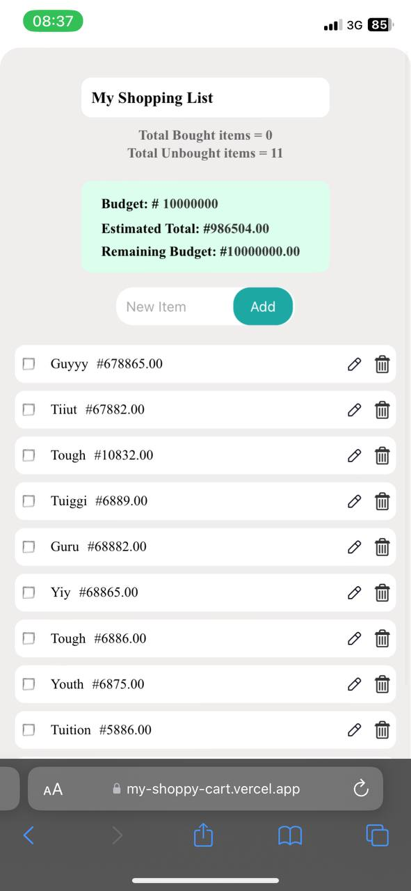

# Shoppy Cart App

A modern, responsive shopping list application built with vanilla JavaScript, HTML, and CSS. This app helps users manage their shopping items with budget tracking, price estimation, and persistent storage.

## Screenshots

### Desktop View


### Mobile View

*Responsive design on mobile devices*


### Demo Video

*Watch the app in action*

### Installation

1. **Create/fork the repository**
   ```
   git clone https://github.com/Ooreoluwaaa/Shoppy-Cart.git
   ```

2. **Navigate to the project directory**
   ```
   cd Shoppy-Cart
   ```

3. **Open the app**
   - Simply open `index.html` in your web browser
   - Or use a local server like Live Server (VS Code extension)


## How to Use

1. **Set Your Budget** (Optional)
   - Click on the budget amount in the green section to set your shopping budget

2. **Add Items**
   - Type the item name in the input field
   - Click "Add" button
   - Enter quantity and price per item in the modal
   - Click "Add Item" to confirm

3. **Manage Items**
   - **Edit**: Click the edit icon to modify item details
   - **Delete**: Click the trash icon to remove an item
   - **Check Off**: Click on the item to mark it as bought

4. **Track Your Spending**
   - View estimated total cost
   - See remaining budget
   - Monitor bought vs unbought items


## Responsive Design

The app is fully responsive and optimized for:
- Mobile devices (320px - 480px)
- Large phones (481px - 768px)
- Tablets and desktops (769px+)

### Budget Management
- Editable budget field with inline editing
- Real-time calculation of estimated total
- Automatic calculation of remaining budget

### Item Management
- Add items with quantity and price
- Edit item details
- Delete items
- Check/uncheck items as you shop

